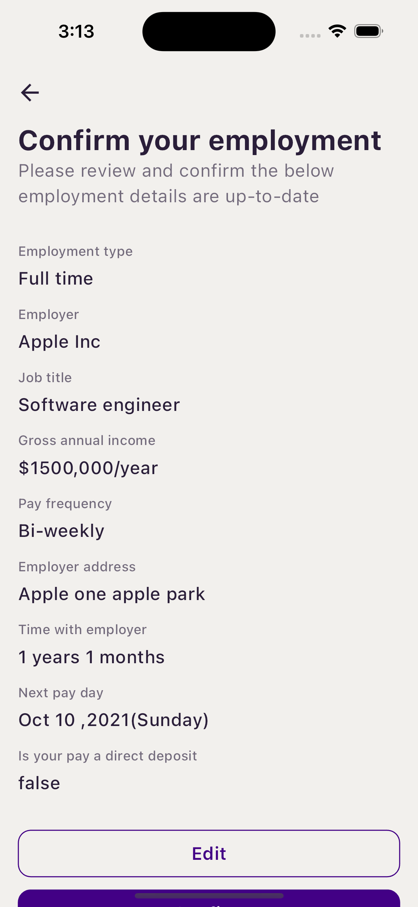

# ava_finance

Ava Finance

## Overview

This is a Flutter application designed using the MVVM architecture pattern with Riverpod for state management. The application features a Credit Score display in a large app bar with animations and dynamic data updates.

- **Flutter Version:** 3.22.1
- **Dart Version:** 3.4.1
- **Figma Design:** [Figma Design Link](https://www.figma.com/design/fgAwUqgFK30hJqYo0byDeG/Untitled?node-id=0-1)

## Test Cases


## Screen Shorts
<p align="center">
  
  
  
  
</p>


## Features
- Display Credit Score with animated circular progress.
- Dynamic data fetching using Riverpod.
- Clean and maintainable codebase with MVVM architecture.
- Customizable and scalable UI components.

## Directory Structure

The directory structure is organized as follows:
   ```lib/
   ├── models/ # Contains data models
   ├── viewmodels/ # Contains the ViewModel classes (business logic and state management)
   ├── views/ # Contains the UI components and screens
   ├── widgets/ # Contains reusable UI widgets
   ├── services/ # Contains services for data fetching and other utilities
   └── utils/ # Contains utility classes and extensions
   ```

### Directory Explanation

- **models/**: This directory includes all the data models used in the application. These models represent the data structure of the information being used.
- **viewmodels/**: This directory contains the ViewModel classes which manage the state and business logic of the application. Riverpod is used for state management.
- **views/**: This directory contains the main UI components and screens of the application. Each screen is structured here.
- **widgets/**: This directory includes reusable UI components that can be used across different parts of the application.
- **services/**: This directory contains service classes responsible for data fetching, API calls, and other data-related operations.
- **utils/**: This directory includes utility classes and extensions that provide helper functions and additional functionalities.

## Setup

1. **Clone the repository:**

   ```bash
   git clone https://github.com/your-repo/credit-score-app.git
   cd credit-score-app
   ```

2. **Install dependencies:**

   ```bash
   flutter pub get
   ```
3. **Run the application:**

   ```bash
   flutter run
   ```
